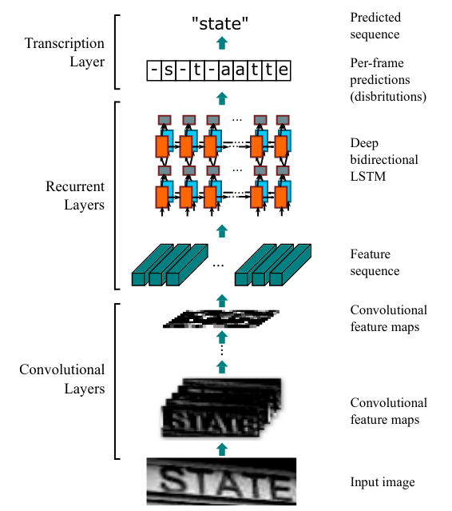

# Convolutional Recurrent Neural Network (CRNN)
This is a TensorFlow implementation of CRNN for scene text recognition.\
The model consists of a CNN stage extracting features which are fed to an RNN stage and a CTC-loss.\
You can find the original paper [here](https://arxiv.org/abs/1507.05717).

## Requirements
The following OS and software versions have been tested:
- Ubuntu 18.04.5 LTS
- Python 3.7.4
- CUDA 10.1
- TensorFlow 1.13.2
## Installation

Clone the repository

    git clone https://github.com/sgenza/tf_crnn.git
    cd tf_crnn
and install dependencies:

    pip install -r requirements.txt
### Using Docker (CPU only)
    docker build -t <your_image_tag> .
    docker run -it <your_image_tag>
## Training

Synth 90k dataset can be downloaded from this [site](https://www.robots.ox.ac.uk/~vgg/data/text/).\
Once downloaded, you need to place the data in the synth90k/ directory.\
You can use your own data, but the annotation files need to conform the Synth 90k format.

Modify the parameters in config/default.yml (or create your own config file) and run:

    python train.py

## Evaluation

You can evaluate the trained model on the following datasets (but first, you need to download and place them in their respective directories):

  1. Synth 90k ([download link](https://www.robots.ox.ac.uk/~vgg/data/text/)).

    python evaluate.py --dataset synth90k

  2. SVT (Street View Text) ([download link](http://vision.ucsd.edu/~kai/svt/)).

    python evaluate.py --dataset SVT

  3. IIIT 5K-word ([download link](https://cvit.iiit.ac.in/research/projects/cvit-projects/the-iiit-5k-word-dataset)).

    python evaluate.py --dataset IIIT5K

## Reference
- [An End-to-End Trainable Neural Network for Image-based Sequence Recognition and Its Application to Scene Text Recognition](https://arxiv.org/abs/1507.05717)
